# Architecture — Liste de courses

PWA de liste de courses partagée, **local-first**, **sans backend applicatif** et **sans coût
d'hébergement**.

---

## 1. Le besoin

Remplacer la note Google Keep partagée qui sert aujourd'hui de liste de courses familiale.

| #   | Contrainte                                                                                              |
| --- | ------------------------------------------------------------------------------------------------------- |
| 1   | **PWA** — navigateur desktop et mobile, installable, utilisable hors ligne                              |
| 2   | **Angular + NgRx** — code relisible, stack familière                                                    |
| 3   | **0 €** — pas d'abonnement, pas de provider, pas de serveur. Front sur GitHub Pages                     |
| 4   | **Temps réel** — quand l'un coche, l'autre voit                                                         |
| 5   | **Réseau dégradé** — le centre commercial capte très mal, il faut pouvoir se synchroniser sans internet |
| 6   | **Un article ≠ un libellé** — libellé, description distinctive, quantité, petite image                  |
| 7   | **Les courses se répètent** — historique réutilisable, pas de ressaisie                                 |

### Contrainte 6, illustrée

Deux articles peuvent porter le même libellé et rester des produits totalement différents :

| Libellé | Description          | Image |
| ------- | -------------------- | ----- |
| Yaourt  | à la vanille         | 🍦    |
| Yaourt  | Firen, pour le petit | 🍼    |

C'est cette distinction qui impose une entité **produit** de premier plan, et pas une simple
chaîne de caractères par ligne de liste.

---

## 2. Le principe : local-first, CRDT au centre

Il n'y a pas de base de données serveur. Chaque appareil détient une **réplique complète** de
l'état dans un CRDT [Yjs](https://github.com/yjs/yjs), persisté en IndexedDB. Toutes les écritures
sont locales et instantanées — cocher un article ne dépend jamais du réseau.

Synchroniser se réduit alors à faire circuler des `Uint8Array` d'un appareil à l'autre, par
n'importe quel canal. Yjs garantit que quels que soient l'ordre d'arrivée, les doublons et les
retards, les répliques **convergent vers le même état**.

C'est ce qui rend le reste possible : plusieurs transports peuvent tourner en parallèle sans se
marcher dessus, et un transport peut être ajouté ou retiré sans toucher au métier.

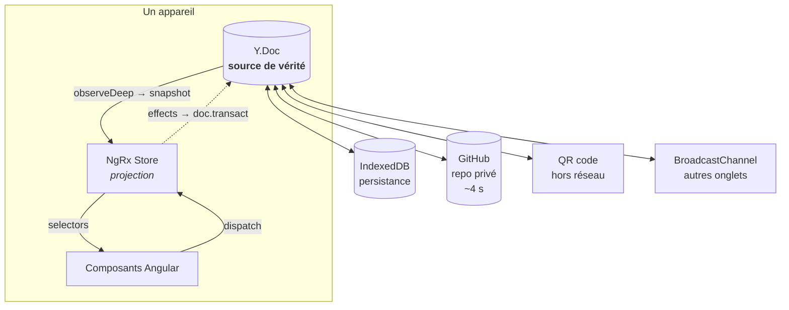

---

## 3. Modèle de données

Le fait que les courses se répètent oriente tout le modèle. On ne stocke pas un libellé sur chaque
ligne de liste : on tient un **catalogue de produits** durable, et la liste n'est qu'un ensemble de
**références** vers ce catalogue.

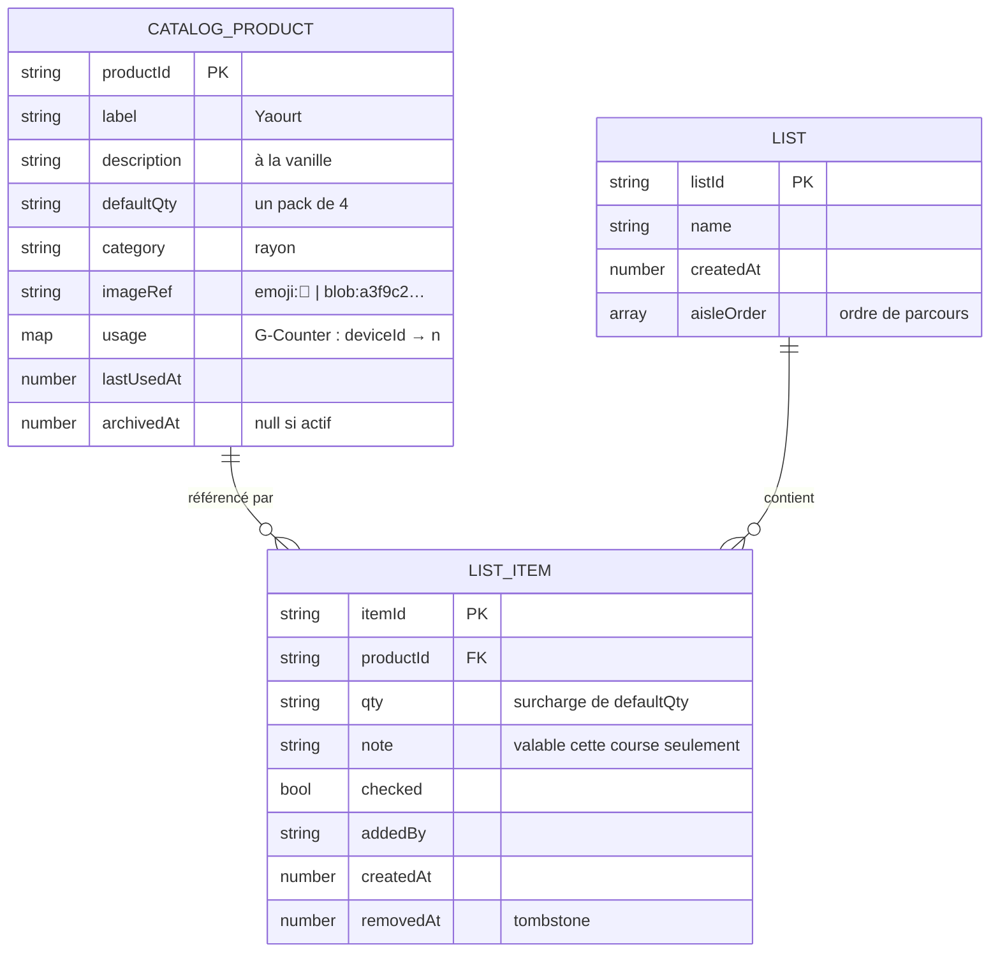

Arborescence Yjs correspondante :

```
Y.Doc
├── catalog          : Y.Map<productId, Y.Map>   racine
├── listMeta         : Y.Map<string, string|number>
│                      clés plates « name:<listId> », « createdAt:<listId> »
└── items:<listId>   : Y.Map<itemId, Y.Map>      une racine par liste
```

#### Pourquoi les articles sont à la racine, et pas dans `lists.get(listId)`

`doc.getMap(nom)` est **déterministe** : deux appareils qui appellent
`getMap('items:maison')` désignent le même type partagé, même s'ils ne se sont
jamais parlé, et leurs contenus fusionnent.

`lists.set('maison', new Y.Map())` ne l'est pas : chaque appareil crée un nœud
_distinct_, et la fusion n'en garde qu'un. Tout ce que contenait le perdant
devient inatteignable.

Ce n'était pas théorique. La première implémentation stockait bien les articles
dans un nœud imbriqué, et le test de bout en bout « la liste survit à un
rechargement » échouait **une fois sur trois** :

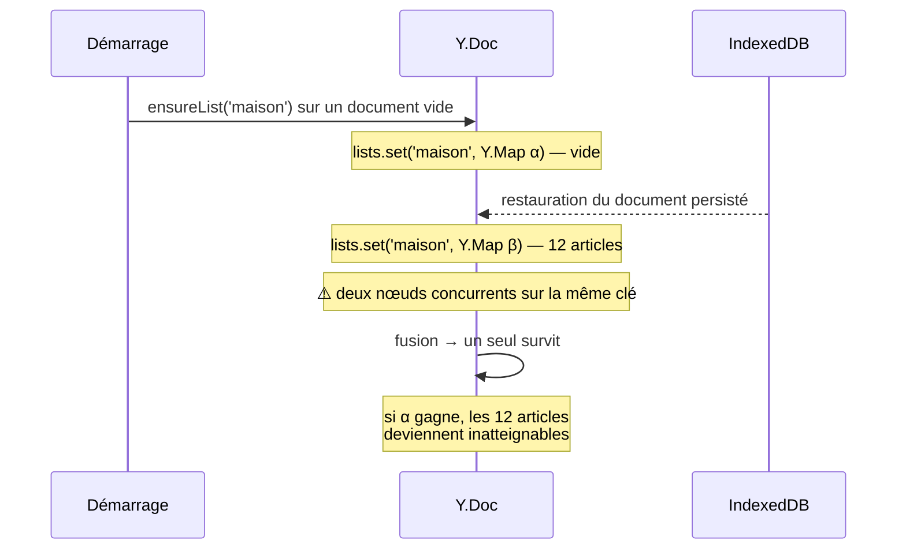

Attendre IndexedDB avant d'amorcer n'aurait été qu'un pansement : le même
scénario se rejoue au premier appairage avec GitHub, quand le document distant
arrive après l'amorçage local.

Les métadonnées de liste sont donc des **clés plates scalaires** : une écriture
concurrente y est un simple dernier-écrivain-gagne sur une chaîne, sans perte de
contenu. Au pire, l'un des deux noms l'emporte.

Le catalogue, lui, était déjà sûr : c'est une racine, et les produits ont des
identifiants aléatoires qui ne peuvent pas entrer en collision.

### Ce que la séparation catalogue / liste apporte

- **Ressaisir devient inutile.** Refaire la liste de la semaine, c'est taper sur des entrées
  existantes.
- **Corriger une fois corrige partout.** Changer l'image ou la description d'un produit se
  répercute sur toutes les listes, passées et futures.
- **`state.bin` reste petit.** Libellé, description et référence d'image sont stockés une fois, pas
  à chaque réapparition.
- **Le catalogue est partagé.** Il vit dans le CRDT : le produit créé par l'un apparaît dans les
  suggestions de l'autre. C'est de la connaissance familiale, pas une préférence locale.

Ajouter un article crée toujours l'entrée de catalogue correspondante — c'est ce qui constitue
l'historique, sans geste supplémentaire.

### Trois décisions à retenir

**Soft delete plutôt que `Y.Map.delete()`.** Une vraie suppression Yjs gagne toujours contre une
édition concurrente. Avec un tombstone `removedAt`, « je supprime » et « elle décoche » en même
temps restent réconciliables, et on gagne l'annulation.

**`usage` est un G-Counter, pas un entier.** Une valeur LWW perdrait des incréments concurrents :

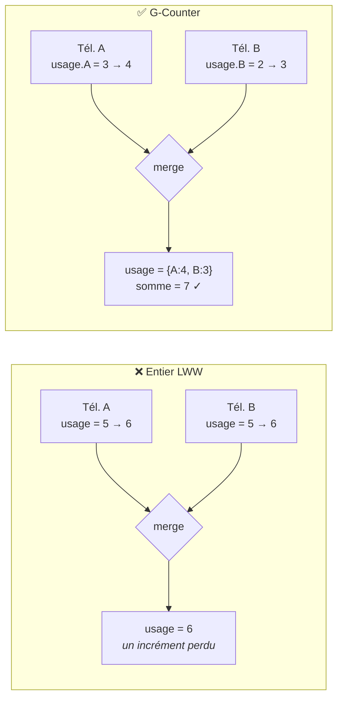

On stocke un compteur _par appareil_ et on somme à la lecture. Trois lignes de code, et c'est
correct. Le tri des suggestions combine ce total et `lastUsedAt`.

**Purge différée.** Les lignes de liste supprimées ou cochées depuis plus de 30 jours sont
réellement effacées (`doc.gc = true` fait le reste). Les entrées de **catalogue** ne sont jamais
purgées automatiquement — c'est l'historique, c'est le but. Un écran « Gérer le catalogue » permet
d'archiver à la main.

> Pas d'indexation fractionnaire en v1 : le tri est _rayon → alphabétique_, ce qui évite tout
> conflit d'ordre. À ajouter seulement si le réordonnancement manuel devient un besoin.

---

## 4. Les images vivent en dehors du CRDT

C'est le point qui mérite le plus d'attention : **mettre les images dans le Y.Doc casserait tout le
reste.** `state.bin` passerait de quelques kilo-octets à plusieurs méga-octets, dépasserait la
limite de 1 Mo de l'API Contents de GitHub, et rendrait l'échange par QR code impossible.

Le CRDT ne contient donc **qu'une référence**, jamais des pixels.

| `imageRef`    | Poids dans le CRDT | Usage                                                                   |
| ------------- | ------------------ | ----------------------------------------------------------------------- |
| `emoji:🍦`    | ~8 octets          | Par défaut. Sélecteur d'emoji + suggestion automatique déduite du rayon |
| `blob:<hash>` | ~24 octets         | Une vraie photo prise avec le téléphone                                 |

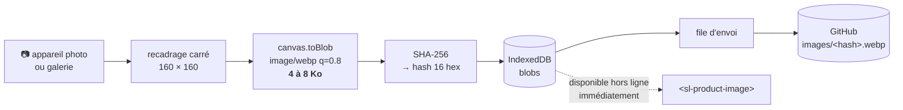

Les blobs sont **adressés par contenu** : un fichier n'est jamais modifié, seulement créé. Donc
aucun conflit possible, aucun `sha` à gérer, et un cache local valable indéfiniment. Un appareil
qui rencontre un `blob:` inconnu télécharge `images/<hash>.webp` de façon paresseuse.

> **Conséquence assumée :** l'échange par QR ne transporte pas les images. Un produit inconnu du
> récepteur s'affiche avec l'emoji de son rayon, et la photo se complète au retour du réseau. Dans
> un rayon de supermarché, on a besoin du libellé et de la description, pas de la photo du yaourt.

---

## 5. Angular / NgRx — le store est une projection, pas la vérité

Piège classique quand on marie NgRx et un CRDT : se retrouver avec deux sources de vérité qui
divergent. On l'évite avec un flux strictement unidirectionnel — **le store ne s'écrit jamais
lui-même**, il ne fait que refléter le Y.Doc.

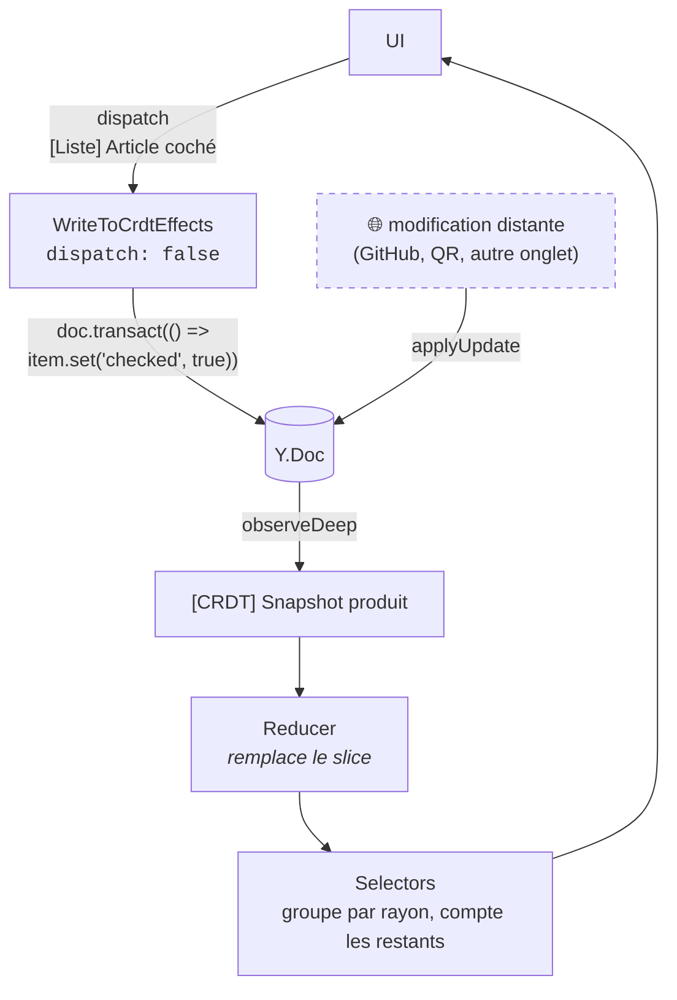

Une modification locale et une modification arrivée de GitHub empruntent **exactement le même
chemin**. Il n'y a rien de spécial à écrire pour le distant, et les DevTools rejouent toute la
session de courses.

### Répartition Store / SignalStore

| Périmètre                                                                      | Outil                           |
| ------------------------------------------------------------------------------ | ------------------------------- |
| Domaine : liste, catalogue, statut de synchro                                  | `@ngrx/store` + `@ngrx/effects` |
| État d'écran éphémère : filtre, recherche, item en édition, étape du wizard QR | `@ngrx/signals`                 |

> **Règle de partage** — si ça doit survivre à un rechargement ou apparaître dans les DevTools de
> synchro, c'est dans le Store. Si ça meurt avec le composant, c'est un SignalStore.

### Slices du Store

| Slice     | Contenu                                                                                                |
| --------- | ------------------------------------------------------------------------------------------------------ |
| `list`    | Projection normalisée du Y.Doc. Un seul reducer, une seule action entrante : `[CRDT] Snapshot produit` |
| `catalog` | Projection du catalogue, alimentée par le **même** snapshot. Les selectors en dérivent les suggestions |
| `sync`    | Par provider : statut, modifications en attente, horodatage du dernier échange, dernière erreur        |
| `blobs`   | État des images : présente / en téléchargement / en attente d'envoi / absente. Aucun octet d'image     |

### Effects

| Effect                 | Rôle                                                                     |
| ---------------------- | ------------------------------------------------------------------------ |
| `WriteToCrdtEffects`   | Intentions utilisateur → `doc.transact()`                                |
| `CrdtSnapshotEffects`  | `fromYDoc(doc)` → `auditTime(0)` → `[CRDT] Snapshot produit`             |
| `GithubSyncEffects`    | Polling ETag et push                                                     |
| `NetworkEffects`       | Sonde réseau, bascule en ligne/hors ligne, purge de la file              |
| `ImagePipelineEffects` | Redimensionnement, WebP, hachage, écriture IndexedDB, mise en file       |
| `BlobFetchEffects`     | Télécharge les `blob:` référencés mais absents, sans bloquer l'affichage |

### Transformations de données

Toute la logique de transformation (selectors, scoring des suggestions, groupement par rayon)
utilise [`taninsam`](https://evanliomain.github.io/taninsam) :

```ts
chain(products)
  .chain(filter((p: Product) => null === p.archivedAt))
  .chain(
    sortBy<Product>(
      (p) => -usageTotal(p),
      (p) => -p.lastUsedAt,
    ),
  )
  .chain(take(20))
  .value();
```

`sortBy` accepte plusieurs clés, `partition` groupe par rayon, `sumBy` somme le G-Counter.

---

## 6. La couche de synchro : une interface, plusieurs transports

```ts
export interface SyncProvider {
  readonly id: string;
  readonly label: string;
  readonly status: Signal<SyncStatus>;
  connect(doc: Y.Doc): void;
  disconnect(): void;
}
```

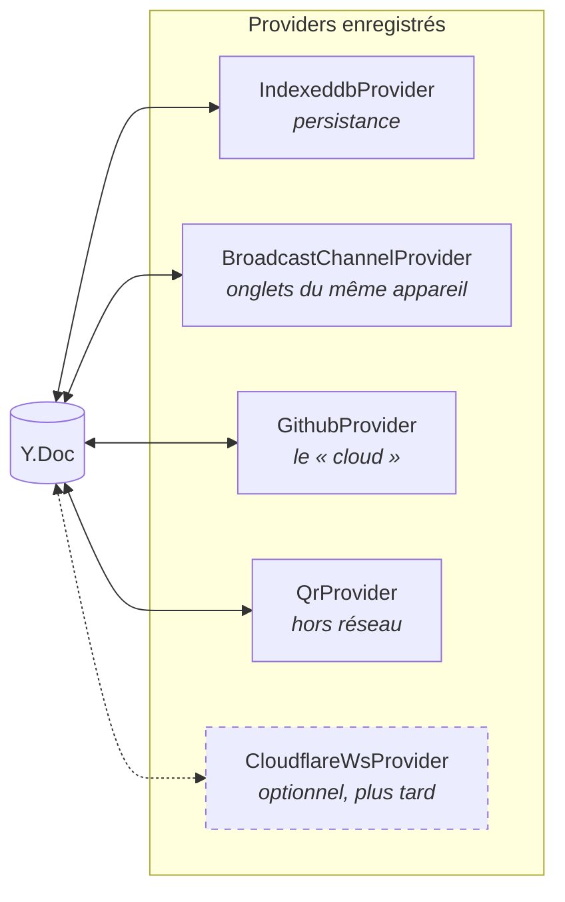

C'est ce point d'extension qui rend le choix « GitHub maintenant, Cloudflare peut-être plus tard »
non engageant. Le jour où les 4 secondes gênent, un `CloudflareWsProvider` s'enregistre à côté des
autres sans qu'aucune ligne de métier ne bouge — Yjs tolère parfaitement plusieurs transports
actifs simultanément.

---

## 7. GitHub comme boîte aux lettres

Un **repo privé** dédié (`shopping-list-data`) :

```
state.bin              Y.encodeStateAsUpdate(doc), base64
                       instantané complet (pas un journal) → pas de croissance non bornée
                       catalogue + listes, ~10 à 30 Ko même après des mois d'usage
images/
  a3f9c2d1e8b47f05.webp    immuable, adressé par contenu, écrit une seule fois
  7e14b8a96c02df31.webp
```

Repo privé et pas Gist : l'API Contents expose un `sha`, donc du contrôle de concurrence
optimiste. L'API Gist écrase en silence.

Les deux flux sont indépendants : `state.bin` est le chemin chaud, `images/` est froid (écriture
unique, lecture paresseuse, cache définitif). Une image en cours d'envoi ne bloque jamais la
synchro de la liste.

### Écriture — immédiate, debounce 500 ms

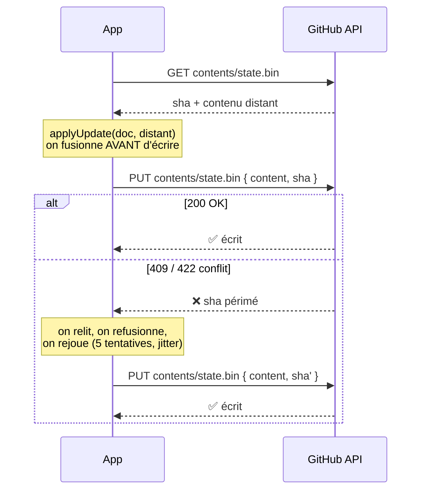

Le conflit n'est jamais un problème métier : le CRDT converge, la boucle de retry finit toujours
par passer.

### Lecture — polling 4 s, seulement si l'onglet est visible et le réseau up

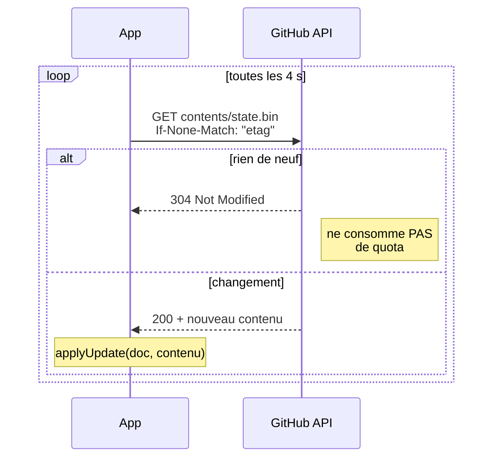

Quota de 5000 requêtes/h par token, usage réel ~900/h dont l'écrasante majorité en 304 gratuits.
Aucun risque de saturation. Le polling ne tourne qu'au premier plan : ça économise la batterie et
ça respecte le fait qu'iOS ne donne pas de background sync aux PWA.

### Authentification et appairage

- PAT _fine-grained_ limité à `Contents: Read & Write` **sur ce seul repo**, expiration la plus
  longue possible. Stocké en IndexedDB.
- Le second appareil s'appaire en scannant un QR contenant `{ owner, repo, token }`.
- Sur `401`, l'app affiche un écran de réappairage plutôt que d'échouer en silence. Une bannière
  prévient 30 jours avant l'expiration.

> ⚠️ **Le QR d'appairage est un identifiant.** Ne pas le laisser traîner dans une pellicule photo
> partagée. Le token est en clair dans IndexedDB : acceptable pour une portée aussi étroite (un
> repo privé de liste de courses), pas au-delà.

---

## 8. Hors réseau

### Cas nominal — file d'attente offline agressive

C'est ce qui sert 95 % du temps. Tout est écrit localement sans jamais bloquer. Un delta Yjs pour
« coché/décoché » pèse **~100 octets** : ça passe même en EDGE.

- Rejeu avec backoff : 1 s, 2 s, 4 s, 8 s… plafonné à 30 s.
- On **sonde réellement** le réseau plutôt que de faire confiance à `navigator.onLine`, qui ment
  sur mobile.
- Bandeau permanent : `Hors ligne · 3 modifs en attente`.

### Secours — échange par QR code animé

Quand il n'y a vraiment rien. Le protocole exploite le fait que les deux appareils ont déjà
quasiment la même liste : on n'échange que les **deltas**, en passant d'abord les vecteurs d'état.

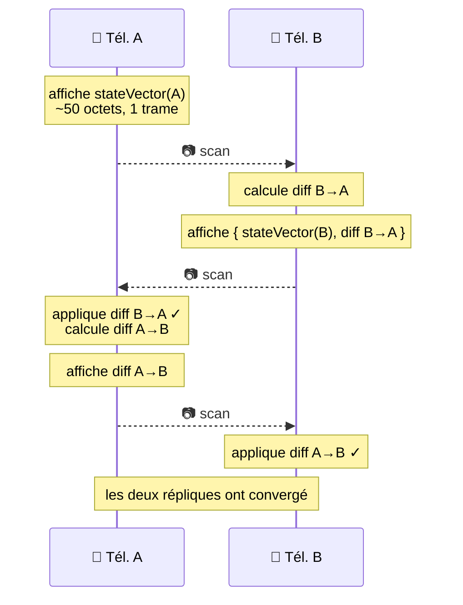

Détails techniques :

- Compression via `CompressionStream('deflate-raw')` — natif, aucune dépendance.
- Découpage en trames de ~800 octets. On reste sous les QR version 40 : au-delà, les modules
  deviennent trop fins pour être lus depuis l'écran d'un autre téléphone.
- Format de trame : `SL1|<sessionId>|<idx>|<total>|<payload base64url>` + hash du payload complet.
- Les trames défilent **en boucle** à ~5 fps. Le récepteur affiche `2/3 trames` et rattrape ce qui
  lui manque au tour suivant — pas besoin de fountain coding pour 3 trames.

> **Deltas uniquement, et c'est essentiel avec un catalogue.** 300 produits pèsent une dizaine de
> Ko compressés, soit une quinzaine de trames — infaisable à scanner. C'est précisément pourquoi le
> protocole échange d'abord les vecteurs d'état : en rayon, la différence se limite à quelques
> cases cochées, donc **une trame**. Garde-fou : au-delà de **10 trames**, l'app refuse et affiche
> « trop de données pour un QR, refaites-le avec du réseau ». Le premier appairage se fait de toute
> façon à la maison, via GitHub.

Lecture caméra : `getUserMedia({ video: { facingMode: 'environment' } })` + `BarcodeDetector`, avec
repli sur `zxing-wasm` dans un Web Worker là où l'API native manque.

### Et le Bluetooth ?

**Impossible depuis une PWA.** L'API Web Bluetooth n'expose que le rôle _GATT central_ — le
navigateur peut se connecter à un objet connecté, jamais s'annoncer comme périphérique. Deux
navigateurs ne peuvent donc pas s'appairer. Et Safari iOS ne l'implémente pas du tout.

C'est définitif tant qu'on reste en PWA pure. Il faudrait un wrapper natif (Capacitor + plugin BLE
ou Nearby Connections) pour y accéder.

---

## 9. Structure du monorepo

```
apps/
  shopping-list/              Angular 21 standalone, zoneless, service worker
  shopping-list-e2e/          Playwright

libs/
  core/crdt/                  schéma Y.Doc (catalogue + listes), opérations, snapshot, purge
  core/blobs/                 store d'images adressé par contenu : redim., WebP, SHA-256, IndexedDB
  core/sync/                  interface SyncProvider + registre
  core/sync-indexeddb/        y-indexeddb + BroadcastChannel
  core/sync-github/           client API, polling ETag, push avec retry 409, envoi des images
  core/qr/                    rendu SVG et lecture caméra de QR codes
  core/sync-qr/               découpage/réassemblage de trames, scanner, machine à états
  data-access/shopping/       NgRx : actions, reducer, selectors, effects
                              (liste ET catalogue : deux tranches d'une seule
                              projection du même document, alimentées par la
                              même action — les séparer imposait une dépendance
                              data-access → data-access)
  data-access/sync/           NgRx : statut de synchro, file offline, état des blobs
  feature/list/               page liste, ligne article, barre d'ajout avec suggestions
  feature/product/            fiche produit : libellé, description, quantité, image
  feature/catalog/            parcours de l'historique, archivage, correction en masse
  feature/pairing/            appairage GitHub, réglages
  feature/nearby/             assistant d'échange QR
  ui/                         composants muets, tokens de design, <sl-product-image>
  util/categories/            dictionnaire produit → rayon + emoji par défaut (français)
```

Les tags Nx font respecter les frontières :

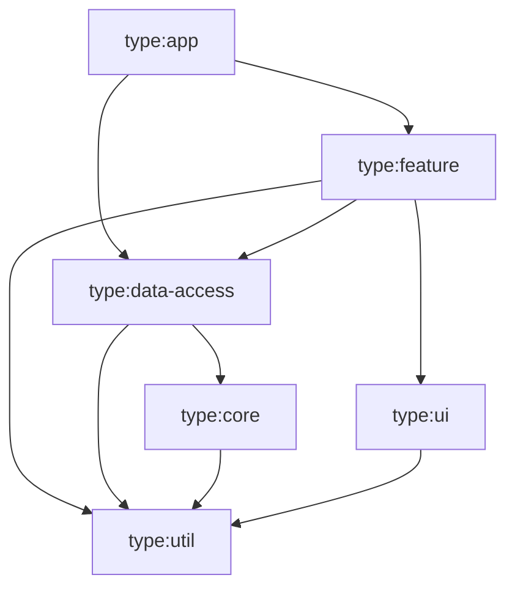

- `feature` n'importe jamais `feature`
- `core` n'importe jamais `data-access` ni `feature`
- `ui` ne dépend que de `util`

---

## 10. Stack et versions

| Brique     | Version | Pourquoi                                                 |
| ---------- | ------- | -------------------------------------------------------- |
| Nx         | 22.7.8  | Cible Angular ~21.2 et NgRx ^21.0 — le trio est cohérent |
| Angular    | ~21.2   | **LTS jusqu'en mai 2027.** Standalone, signals, zoneless |
| NgRx       | ~21.1   | Dernière stable. Déclare `@angular/core: ^21.0.0`        |
| Yjs        | ^13.6   | CRDT mature, léger, écosystème de providers              |
| taninsam   | ^1.17   | Transformations de données                               |
| TypeScript | ~5.9    | Requis par Angular 21                                    |

> **Pourquoi pas Angular 22 ?** NgRx stable est en 21 et déclare `@angular/core: ^21.0.0` ; seule
> une `22.0.0-beta.0` existe. NgRx étant une contrainte du projet et Angular 22 une simple
> préférence, on prend Angular 21 LTS : peer deps propres, pas de `--legacy-peer-deps` à traîner en
> CI. Signals, zoneless et standalone sont tous là en 21.

> **Pourquoi pas `create-nx-workspace` ?** Nx 23 a transformé les presets en templates GitHub
> clonés (`--preset=angular-monorepo` → `nrwl/angular-template`), qui ignorent les flags et livrent
> une démo e-commerce avec SSR et Nx Cloud. Le workspace a donc été construit à la main puis
> complété par les générateurs `@nx/angular`.

---

## 11. PWA et déploiement

- `@angular/service-worker` : app shell en `prefetch`, invite `SwUpdate` (« Nouvelle version
  disponible ») plutôt qu'un rechargement sauvage au milieu des courses.
- `baseHref: /shopping-list/`, `404.html` copié depuis `index.html` pour les liens profonds,
  fichier `.nojekyll`.
- GitHub Actions : `nx build` → `upload-pages-artifact` → `deploy-pages`.
- iOS : `apple-touch-icon`, installation par « Sur l'écran d'accueil ». Pas de background sync sur
  iOS — la synchro se fait à l'ouverture et au retour au premier plan.
- GitHub Pages sert en HTTPS : service worker, caméra et IndexedDB sont tous disponibles.

---

## 12. Découpage en lots

| Lot      | Contenu                                                                             | Ce qui marche à la fin                                                          |
| -------- | ----------------------------------------------------------------------------------- | ------------------------------------------------------------------------------- |
| **0** ✅ | Workspace Nx, app Angular, PWA, CI vers Pages                                       | Coquille installable sur les deux téléphones                                    |
| **1** ✅ | Schéma CRDT, G-Counter, IndexedDB, Store NgRx, UI liste, fiche produit, suggestions | App complète **mono-appareil**, 100 % hors ligne, avec réutilisation d'articles |
| **2**    | Provider GitHub, appairage par QR, indicateur de statut                             | **Synchro à deux appareils** — le cœur du besoin                                |
| **3**    | File offline, sonde réseau, bannière, invite `SwUpdate`                             | Robuste en réseau dégradé                                                       |
| **4**    | Échange QR de proximité                                                             | Synchro sans aucun réseau                                                       |
| **5**    | Photos : capture, WebP, store adressé par contenu, sync GitHub                      | Vraies images sur les produits                                                  |
| **6**    | Rayons, gestion du catalogue, multi-listes, « modifié il y a 2 min par … »          | Confort au quotidien                                                            |

Les lots 0→2 constituent déjà un remplaçant fonctionnel de Google Keep, et plus complet que lui du
fait de l'historique.

Le découpage n'est pas arbitraire : les emojis arrivent dès le lot 1 parce qu'ils ne coûtent rien
et couvrent l'essentiel du besoin visuel. Les photos attendent le lot 5 parce qu'elles dépendent du
provider GitHub du lot 2 et introduisent un second canal de synchronisation — la partie la plus
lourde pour le bénéfice le plus faible.

---

## 13. Stratégie de test

### Unitaires (Vitest)

| Cible                   | Ce qu'on vérifie                                                                                                                                                   |
| ----------------------- | ------------------------------------------------------------------------------------------------------------------------------------------------------------------ |
| **Convergence CRDT**    | Test de propriété : N opérations concurrentes appliquées dans un ordre aléatoire sur plusieurs répliques → snapshots identiques. Le test qui protège tout le reste |
| **G-Counter**           | Deux appareils incrémentent hors ligne le même produit → après fusion le total vaut **2**, pas 1                                                                   |
| **Reducer / selectors** | Groupement par rayon, compte des restants, filtrage des tombstones, ordre des suggestions, exclusion des archivés                                                  |
| **Provider GitHub**     | `fetch` mocké : chemin 304, chemin 200, et surtout **le chemin 409** — deux écritures concurrentes doivent converger, pas se perdre                                |
| **Store de blobs**      | Le même fichier encodé deux fois donne le même hash (un seul envoi) ; un `blob:` absent ne fait jamais planter le rendu                                            |
| **Trames QR**           | Aller-retour découpage/réassemblage, trames désordonnées, trame manquante rattrapée, payload corrompu rejeté, **refus au-delà de 10 trames**                       |

### End-to-end (Playwright)

Deux contextes navigateur, un provider de synchro factice en mémoire : A ajoute → B voit ; B coche
→ A voit ; A passe hors ligne, les deux modifient, A revient → convergence.

### Validation manuelle

1. Installer sur les deux téléphones depuis l'URL GitHub Pages.
2. Ajouter des articles chacun de son côté, vérifier l'arrivée sous ~5 s.
3. Créer les deux « Yaourt » (vanille / Firen) avec descriptions et photos distinctes ; vérifier
   qu'ils restent lisibles d'un coup d'œil.
4. **Faire la liste de la semaine suivante uniquement depuis les suggestions**, sans rien retaper.
5. Photographier un produit sur un téléphone, vérifier l'apparition sur l'autre, puis couper le
   réseau du second → l'image reste disponible.
6. Mode avion, cocher plusieurs articles, repasser en ligne → tout remonte.
7. **Les deux téléphones en mode avion** : échange QR, vérifier la correspondance — et qu'un
   produit reçu sans image s'affiche proprement avec son emoji.
8. Une vraie session de courses au centre commercial — le seul test qui valide vraiment le lot 3.
